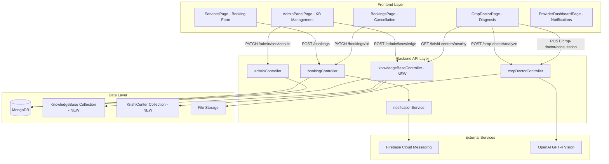

# Design Document: AgriConnect Platform Enhancements

## Overview

This design addresses six critical enhancements to the AgriConnect platform that improve user experience, fix existing bugs, and expand functionality. The enhancements span frontend validation, real-time notifications, administrative workflows, farmer capabilities, knowledge management, and diagnostic tools.

The platform currently uses:
- Backend: Node.js/TypeScript with Express
- Frontend: React with TypeScript
- Database: MongoDB with Mongoose ODM
- Real-time: Firebase Cloud Messaging (FCM) for push notifications
- File Storage: Multer for multipart uploads (currently in-memory)
- Authentication: JWT-based with role-based access control (RBAC)

### Enhancement Summary

1. **Mandatory Date Selection**: Frontend validation to prevent bookings without dates
2. **Real-time Provider Notifications**: Enhanced notification payload with booking details
3. **Admin Service Approval Fix**: Correct API endpoint and error handling
4. **Farmer Booking Cancellation**: New UI and backend support for farmer-initiated cancellations
5. **Admin Knowledge Base Management**: CRUD operations for chatbot and crop doctor knowledge
6. **Enhanced Crop Doctor**: Location-based Krishi center lookup, photo upload, and consultation requests

## Architecture

### System Components



### Data Flow

#### Enhancement 1: Mandatory Date Selection
1. User opens ServicesPage booking form
2. Frontend validates date field is populated before enabling submit
3. Frontend validates date is not in the past
4. If validation fails, display inline error message
5. If validation passes, allow POST /bookings request

#### Enhancement 2: Real-time Provider Notifications
1. Farmer creates booking via POST /bookings
2. bookingController calls notificationService.sendPushNotification
3. Notification payload includes: service type, date, time slot, farmer name, farmer phone
4. FCM delivers notification to provider's device
5. If provider offline, FCM queues notification for delivery on reconnect

#### Enhancement 3: Admin Service Approval Fix
1. Admin clicks approve/reject button in AdminPanelPage
2. Frontend sends PATCH /admin/services/:id with { status: 'active' | 'rejected' }
3. adminController validates status and updates Service document
4. Frontend displays success/error message
5. Frontend refreshes service list to show updated status

#### Enhancement 4: Farmer Booking Cancellation
1. Farmer views bookings in BookingsPage
2. Farmer clicks cancel button on eligible booking (Pending or Accepted status)
3. Frontend sends PATCH /bookings/:id with { status: 'Cancelled', cancellationReason: '...' }
4. bookingController validates transition rules and caller permissions
5. Backend updates booking status and notifies provider
6. Frontend displays success confirmation

#### Enhancement 5: Admin Knowledge Base Management
1. Admin navigates to KB management tab in AdminPanelPage
2. Admin fills form with question/answer or disease/treatment data
3. Frontend sends POST /admin/knowledge with entry data
4. Backend stores in KnowledgeBase collection
5. Chatbot and Crop Doctor immediately query new data (no restart required)

#### Enhancement 6: Enhanced Crop Doctor
1. Farmer captures photo using device camera
2. Frontend requests location permission and gets GPS coordinates
3. Frontend sends POST /crop-doctor/analyze with image file
4. Backend calls OpenAI GPT-4 Vision API for diagnosis
5. Frontend sends GET /krishi-centers/nearby?lat=X&lng=Y
6. Backend queries KrishiCenter collection with geospatial index
7. Frontend displays diagnosis + 3 nearest Krishi centers with phone numbers
8. Farmer optionally sends consultation request with photo

## Components and Interfaces

### Frontend Components

#### 1. ServicesPage.tsx (Modified)

**Purpose**: Add date validation to booking form

**Changes**:
- Add state for validation errors: `const [dateError, setDateError] = useState('')`
- Add validation function:
```typescript
function validateBookingDate(dateStr: string): boolean {
  if (!dateStr) {
    setDateError('Please select a booking date');
    return false;
  }
  const selected = new Date(dateStr);
  const today = new Date();
  today.setHours(0, 0, 0, 0);
  if (selected < today) {
    setDateError('Booking date cannot be in the past');
    return false;
  }
  setDateError('');
  return true;
}
```
- Modify book() function to call validateBookingDate before API request
- Add visual indicator (red border, error text) when validation fails
- Disable submit button when date is empty

**Props**: None (existing component)

**State**:
- `dateError: string` - validation error message
- `bookingDate: Record<string, string>` - existing, tracks selected dates per service

#### 2. BookingsPage.tsx (Modified)

**Purpose**: Add cancellation functionality for farmers

**Changes**:
- Add cancellation modal state: `const [cancelModal, setCancelModal] = useState<{bookingId: string, show: boolean}>({bookingId: '', show: false})`
- Add cancellation reason state: `const [cancelReason, setCancelReason] = useState('')`
- Add cancel button to each booking card (only for Pending/Accepted status)
- Add cancelBooking function:
```typescript
async function cancelBooking(bookingId: string) {
  try {
    await axios.patch(`/api/bookings/${bookingId}`, 
      { status: 'Cancelled', cancellationReason: cancelReason },
      { headers: { Authorization: `Bearer ${token}` } }
    );
    // Refresh bookings list
    const r = await axios.get('/api/bookings', { headers });
    setBookings(r.data);
    setCancelModal({bookingId: '', show: false});
    setCancelReason('');
  } catch (e: any) {
    alert(e.response?.data?.error || 'Cancellation failed');
  }
}
```
- Add cancellation confirmation modal with reason textarea

**Props**: None (existing component)

**State**:
- `cancelModal: {bookingId: string, show: boolean}` - controls modal visibility
- `cancelReason: string` - optional cancellation reason

#### 3. AdminPanelPage.tsx (Modified)

**Purpose**: Fix service approval API calls and add KB management

**Changes**:
- Fix approveService and rejectService functions to use correct endpoint:
```typescript
async function approveService(id: string) {
  try {
    await axios.patch(`/api/admin/services/${id}`, 
      { status: 'active' }, 
      { headers }
    );
    setServices(s => s.map(x => x._id === id ? { ...x, status: 'active' } : x));
    alert('Service approved successfully');
  } catch (e: any) {
    alert(e.response?.data?.error || 'Failed to approve service');
  }
}
```
- Add new tab: 'knowledge' for KB management
- Add KB entry form with fields:
  - Type selector: 'chatbot' | 'crop-doctor'
  - For chatbot: keywords (comma-separated), answer
  - For crop-doctor: disease name, symptoms, treatment, prevention, crop types
- Add KB entry list with edit/delete buttons
- Add functions: addKBEntry, updateKBEntry, deleteKBEntry

**Props**: None (existing component)

**State**:
- `kbEntries: KBEntry[]` - list of knowledge base entries
- `kbForm: {type: string, ...fields}` - form data for new/edit entry

#### 4. CropDoctorPage.tsx (Modified)

**Purpose**: Add photo upload, Krishi center lookup, and consultation requests

**Changes**:
- Add camera capture button using HTML5 file input with `capture="environment"` attribute
- Add photo preview state: `const [photo, setPhoto] = useState<File | null>(null)`
- Add location state: `const [location, setLocation] = useState<{lat: number, lng: number} | null>(null)`
- Add Krishi centers state: `const [krishiCenters, setKrishiCenters] = useState<KrishiCenter[]>([])`
- Request location permission on component mount:
```typescript
useEffect(() => {
  if (navigator.geolocation) {
    navigator.geolocation.getCurrentPosition(
      pos => setLocation({lat: pos.coords.latitude, lng: pos.coords.longitude}),
      err => console.error('Location permission denied', err)
    );
  }
}, []);
```
- Modify analyze() function to send photo if available:
```typescript
async function analyze() {
  const formData = new FormData();
  if (photo) {
    formData.append('image', photo);
  }
  formData.append('description', description);
  
  const response = await axios.post('/api/crop-doctor/analyze', formData, {
    headers: { 
      Authorization: `Bearer ${token}`,
      'Content-Type': 'multipart/form-data'
    }
  });
  
  setResult(response.data);
  
  // Fetch nearby Krishi centers
  if (location) {
    const centers = await axios.get(
      `/api/krishi-centers/nearby?lat=${location.lat}&lng=${location.lng}&limit=3`,
      { headers }
    );
    setKrishiCenters(centers.data);
  }
  
  setMode('result');
}
```
- Add Krishi center display section in result view:
```typescript
{krishiCenters.length > 0 && (
  <div style={styles.section}>
    <h4>📞 Nearby Krishi Centers</h4>
    {krishiCenters.map(center => (
      <div key={center._id} style={styles.centerCard}>
        <strong>{center.name}</strong>
        <p>{center.distance.toFixed(1)} km away</p>
        <a href={`tel:${center.phone}`} style={styles.callBtn}>
          📞 Call {center.phone}
        </a>
      </div>
    ))}
  </div>
)}
```
- Add consultation request button that sends photo + description to selected center

**Props**: None (existing component)

**State**:
- `photo: File | null` - captured/selected photo
- `location: {lat: number, lng: number} | null` - farmer GPS coordinates
- `krishiCenters: KrishiCenter[]` - nearby Krishi centers

#### 5. ProviderDashboardPage.tsx (No Changes)

**Purpose**: Display enhanced notifications (no frontend changes needed)

**Rationale**: FCM notifications are displayed by the device OS notification system. The enhanced payload (farmer name, phone, service details) will appear in the notification text automatically. No frontend code changes required.

### Backend Controllers

#### 1. bookingController.ts (Modified)

**Purpose**: Enhance notification payload and support farmer cancellations

**Changes to createBooking**:
```typescript
// After booking creation, enhance notification
const service = await Service.findById(service_id).populate('provider_id', 'name');
const farmer = await User.findById(user.userId).select('name phone');

await sendPushNotification(
  service.provider_id.toString(),
  'New Booking Request',
  `${farmer.name} (${farmer.phone}) booked ${service.type} on ${bookingDate.toLocaleDateString()} at ${timeSlot}`
);
```

**Changes to updateBookingStatus**:
- Already supports farmer cancellation (existing code validates caller is farmer or provider)
- Ensure cancellation reason is saved: `booking.cancellationReason = cancellationReason`
- Ensure notification is sent to provider when farmer cancels

**No breaking changes**: Existing logic already supports the required transitions.

#### 2. adminController.ts (No Changes to updateServiceStatus)

**Purpose**: Service approval endpoint already exists and works correctly

**Rationale**: The existing `PATCH /admin/services/:id` endpoint in adminController.ts already implements the correct logic. The bug is in the frontend calling the wrong endpoint. No backend changes needed.

#### 3. knowledgeBaseController.ts (NEW)

**Purpose**: CRUD operations for knowledge base entries

**Endpoints**:

```typescript
// POST /admin/knowledge
export async function createKBEntry(req: Request, res: Response): Promise<void> {
  const { type, ...data } = req.body;
  
  if (!['chatbot', 'crop-doctor'].includes(type)) {
    res.status(400).json({ error: 'type must be chatbot or crop-doctor' });
    return;
  }
  
  // Validate required fields based on type
  if (type === 'chatbot') {
    if (!data.keywords || !data.answer) {
      res.status(400).json({ error: 'keywords and answer are required' });
      return;
    }
  } else {
    if (!data.disease || !data.symptoms || !data.treatment) {
      res.status(400).json({ error: 'disease, symptoms, and treatment are required' });
      return;
    }
  }
  
  const entry = await KnowledgeBase.create({ type, ...data });
  res.status(201).json({ entry });
}

// GET /admin/knowledge
export async function getKBEntries(req: Request, res: Response): Promise<void> {
  const { type } = req.query;
  const filter = type ? { type } : {};
  const entries = await KnowledgeBase.find(filter).sort({ createdAt: -1 });
  res.json({ entries });
}

// PATCH /admin/knowledge/:id
export async function updateKBEntry(req: Request, res: Response): Promise<void> {
  const { id } = req.params;
  const updates = req.body;
  
  const entry = await KnowledgeBase.findByIdAndUpdate(id, updates, { new: true });
  if (!entry) {
    res.status(404).json({ error: 'Knowledge base entry not found' });
    return;
  }
  
  res.json({ entry });
}

// DELETE /admin/knowledge/:id
export async function deleteKBEntry(req: Request, res: Response): Promise<void> {
  const { id } = req.params;
  
  const entry = await KnowledgeBase.findByIdAndDelete(id);
  if (!entry) {
    res.status(404).json({ error: 'Knowledge base entry not found' });
    return;
  }
  
  res.json({ message: 'Entry deleted successfully' });
}

// GET /krishi-centers/nearby
export async function getNearbyKrishiCenters(req: Request, res: Response): Promise<void> {
  const { lat, lng, limit = 3 } = req.query;
  
  if (!lat || !lng) {
    res.status(400).json({ error: 'lat and lng query parameters are required' });
    return;
  }
  
  const latitude = parseFloat(lat as string);
  const longitude = parseFloat(lng as string);
  
  if (isNaN(latitude) || isNaN(longitude)) {
    res.status(400).json({ error: 'lat and lng must be valid numbers' });
    return;
  }
  
  // MongoDB geospatial query
  const centers = await KrishiCenter.aggregate([
    {
      $geoNear: {
        near: { type: 'Point', coordinates: [longitude, latitude] },
        distanceField: 'distance',
        maxDistance: 50000, // 50 km radius
        spherical: true,
        distanceMultiplier: 0.001 // Convert meters to kilometers
      }
    },
    { $limit: parseInt(limit as string) }
  ]);
  
  res.json(centers);
}
```

#### 4. cropDoctorController.ts (Modified)

**Purpose**: Add consultation request endpoint

**New endpoint**:
```typescript
// POST /crop-doctor/consultation
export async function sendConsultation(req: Request, res: Response): Promise<void> {
  const { krishiCenterId, description } = req.body;
  const user = req.user!;
  
  if (!krishiCenterId || !description) {
    res.status(400).json({ error: 'krishiCenterId and description are required' });
    return;
  }
  
  // Validate Krishi center exists
  const center = await KrishiCenter.findById(krishiCenterId);
  if (!center) {
    res.status(404).json({ error: 'Krishi center not found' });
    return;
  }
  
  // Handle photo if provided
  let photoUrl = null;
  if (req.file) {
    // Store photo (implementation depends on storage strategy)
    // For now, store base64 in consultation record
    photoUrl = req.file.buffer.toString('base64');
  }
  
  // Create consultation record
  const consultation = await Consultation.create({
    farmer_id: user.userId,
    krishi_center_id: krishiCenterId,
    description,
    photo: photoUrl,
    status: 'pending'
  });
  
  // Send notification to Krishi center (if they have FCM token)
  // This would require Krishi centers to be users in the system
  // For MVP, we'll skip this and assume phone call is primary contact method
  
  res.status(201).json({ consultation });
}
```

### Backend Routes

#### New Routes

```typescript
// routes/knowledge.ts
import { Router } from 'express';
import { 
  createKBEntry, 
  getKBEntries, 
  updateKBEntry, 
  deleteKBEntry,
  getNearbyKrishiCenters
} from '../controllers/knowledgeBaseController';
import { authenticate } from '../middleware/auth';
import { adminOnly } from '../middleware/rbac';

const router = Router();

// Admin-only KB management
router.post('/admin/knowledge', authenticate, adminOnly, createKBEntry);
router.get('/admin/knowledge', authenticate, adminOnly, getKBEntries);
router.patch('/admin/knowledge/:id', authenticate, adminOnly, updateKBEntry);
router.delete('/admin/knowledge/:id', authenticate, adminOnly, deleteKBEntry);

// Public Krishi center lookup (requires authentication)
router.get('/krishi-centers/nearby', authenticate, getNearbyKrishiCenters);

export default router;
```

```typescript
// routes/cropDoctor.ts (modified)
import { Router } from 'express';
import { analyzeImage, uploadMiddleware, sendConsultation } from '../controllers/cropDoctorController';
import { authenticate } from '../middleware/auth';

const router = Router();

router.post('/crop-doctor/analyze', authenticate, uploadMiddleware, analyzeImage);
router.post('/crop-doctor/consultation', authenticate, uploadMiddleware, sendConsultation);

export default router;
```

## Data Models

### New Models

#### KnowledgeBase Collection

```typescript
import { Schema, model, Document } from 'mongoose';

export type KBType = 'chatbot' | 'crop-doctor';

export interface IKnowledgeBase extends Document {
  type: KBType;
  
  // Chatbot fields
  keywords?: string[]; // e.g., ['weather', 'forecast', 'rain']
  answer?: string;
  
  // Crop doctor fields
  disease?: string;
  symptoms?: string;
  treatment?: string;
  prevention?: string;
  crops?: string[]; // e.g., ['Rice', 'Wheat', 'Maize']
  severity?: 'Low' | 'Medium' | 'High' | 'Severe';
  
  createdAt: Date;
  updatedAt: Date;
}

const KnowledgeBaseSchema = new Schema<IKnowledgeBase>(
  {
    type: { 
      type: String, 
      enum: ['chatbot', 'crop-doctor'], 
      required: true 
    },
    
    // Chatbot fields
    keywords: [{ type: String }],
    answer: { type: String },
    
    // Crop doctor fields
    disease: { type: String },
    symptoms: { type: String },
    treatment: { type: String },
    prevention: { type: String },
    crops: [{ type: String }],
    severity: { 
      type: String, 
      enum: ['Low', 'Medium', 'High', 'Severe'] 
    }
  },
  { timestamps: true }
);

// Indexes for efficient querying
KnowledgeBaseSchema.index({ type: 1 });
KnowledgeBaseSchema.index({ keywords: 1 });
KnowledgeBaseSchema.index({ disease: 1 });

export const KnowledgeBase = model<IKnowledgeBase>('KnowledgeBase', KnowledgeBaseSchema);
```

#### KrishiCenter Collection

```typescript
import { Schema, model, Document } from 'mongoose';

export interface IKrishiCenter extends Document {
  name: string;
  phone: string;
  address: string;
  district: string;
  state: string;
  location: {
    type: 'Point';
    coordinates: [number, number]; // [longitude, latitude]
  };
  services: string[]; // e.g., ['Soil Testing', 'Pest Management', 'Training']
  operatingHours?: string;
  email?: string;
}

const KrishiCenterSchema = new Schema<IKrishiCenter>(
  {
    name: { type: String, required: true },
    phone: { type: String, required: true },
    address: { type: String, required: true },
    district: { type: String, required: true },
    state: { type: String, required: true },
    location: {
      type: {
        type: String,
        enum: ['Point'],
        required: true
      },
      coordinates: {
        type: [Number],
        required: true
      }
    },
    services: [{ type: String }],
    operatingHours: { type: String },
    email: { type: String }
  },
  { timestamps: true }
);

// Geospatial index for nearby queries
KrishiCenterSchema.index({ location: '2dsphere' });

export const KrishiCenter = model<IKrishiCenter>('KrishiCenter', KrishiCenterSchema);
```

#### Consultation Collection

```typescript
import { Schema, model, Document, Types } from 'mongoose';

export type ConsultationStatus = 'pending' | 'in-progress' | 'resolved' | 'cancelled';

export interface IConsultation extends Document {
  farmer_id: Types.ObjectId;
  krishi_center_id: Types.ObjectId;
  description: string;
  photo?: string; // Base64 or URL
  status: ConsultationStatus;
  response?: string;
  createdAt: Date;
  updatedAt: Date;
}

const ConsultationSchema = new Schema<IConsultation>(
  {
    farmer_id: { 
      type: Schema.Types.ObjectId, 
      ref: 'User', 
      required: true 
    },
    krishi_center_id: { 
      type: Schema.Types.ObjectId, 
      ref: 'KrishiCenter', 
      required: true 
    },
    description: { type: String, required: true },
    photo: { type: String },
    status: { 
      type: String, 
      enum: ['pending', 'in-progress', 'resolved', 'cancelled'],
      default: 'pending'
    },
    response: { type: String }
  },
  { timestamps: true }
);

ConsultationSchema.index({ farmer_id: 1, status: 1 });
ConsultationSchema.index({ krishi_center_id: 1, status: 1 });

export const Consultation = model<IConsultation>('Consultation', ConsultationSchema);
```

### Modified Models

#### Booking Model (No Schema Changes)

The existing Booking model already supports:
- `status: 'Cancelled'`
- `cancelledBy: 'farmer' | 'provider' | 'system'`
- `cancellationReason: string`

No schema changes needed. The existing fields support farmer cancellation.

## Correctness Properties

*A property is a characteristic or behavior that should hold true across all valid executions of a system—essentially, a formal statement about what the system should do. Properties serve as the bridge between human-readable specifications and machine-verifiable correctness guarantees.*

